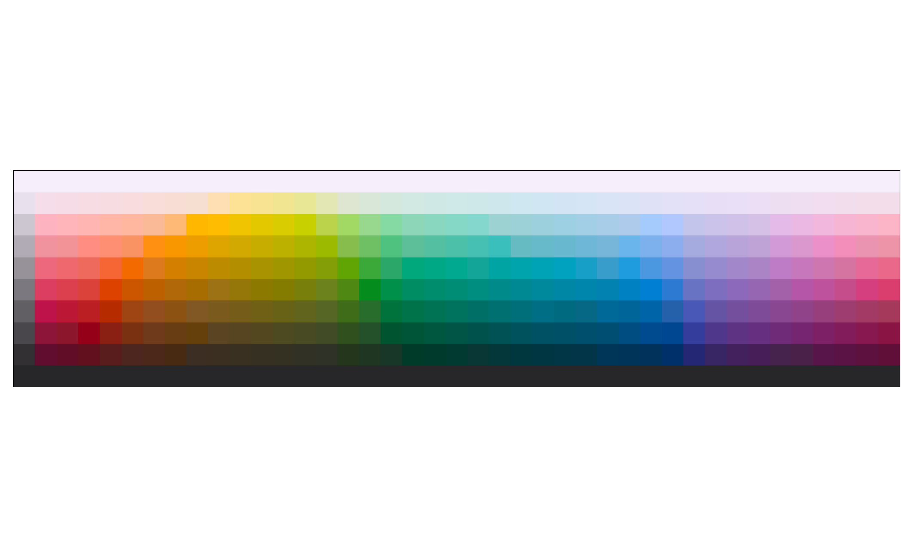
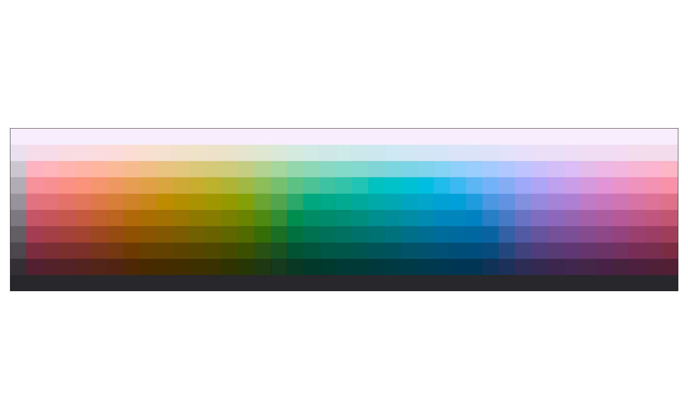
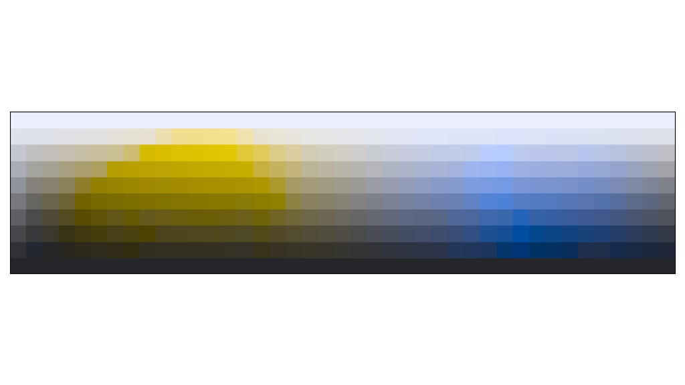
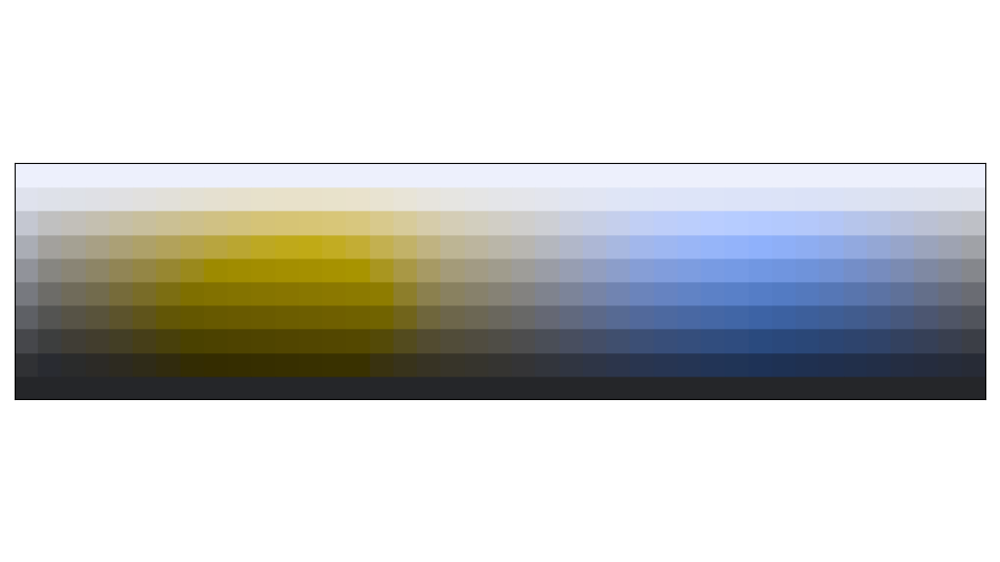

# Munsell Colors

## About

This is a simple Python project, with nix, to produce Munsell color charts with Color Vision Deficiency (CVD) filters. All dependencies are packaged with nix, and a development shell is included. Run `nix develop` to access this development shell after downloading this repository and entering the resulting directory.

## Basic Results

| Description | Image |
| :---: | :---: |
| Normal Munsell Chart |  |
| Munsell Chart with Averaged Chromas |  |
| Munsell Chart with Protanopia |  |
| Munsell Chart with Protanopia and Averaged Chromas |  |
